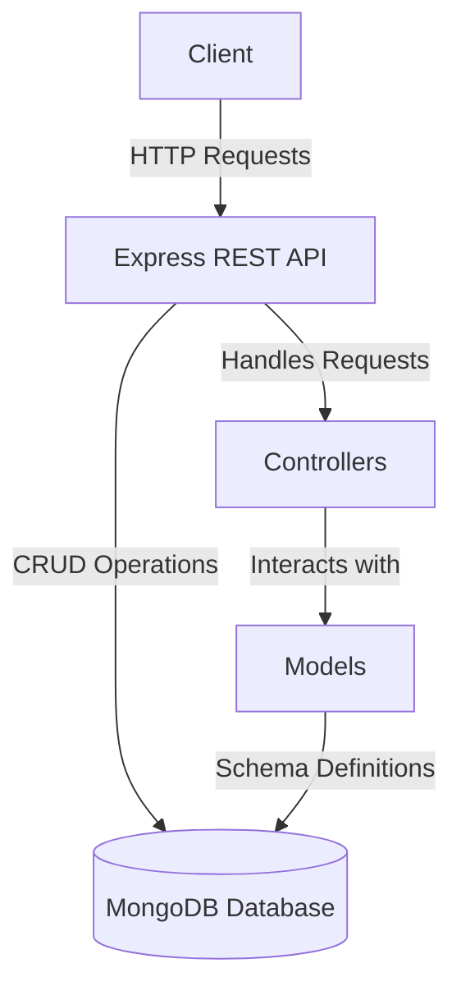

# Simple Restaurant Management System

This project is a simple restaurant management system built using Node.js, Express, and MongoDB. It demonstrates basic CRUD operations through RESTful APIs.

## Features

- Add new restaurants (CREATE operation).
- Add new menu items linked to restaurants.
- Retrieve, Update, and Delete restaurants and menu items.

## Technologies Used

- Node.js
- Express.js
- MongoDB (Atlas)
- Mongoose
- dotenv for environment variable management

## System Architecture

## How to Run

1. Clone the repository.
2. Install dependencies using `npm install`.
3. Set up your `.env` file with the required environment variables (e.g., MongoDB connection string).
4. Start the server using `npm start`.
5. Use tools like Postman or a browser to interact with the APIs.
